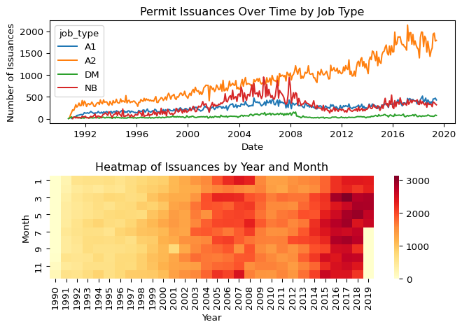

# The L Train Shutdown: Building Permits


## Permits Data

``` python
show(df_permits.head(20))
```

<table id="itables_c24a80ba_42ef_41da_af43_3f43e5399cb1" class="display nowrap" data-quarto-disable-processing="true" style="table-layout:auto;width:auto;margin:auto;caption-side:bottom">
<thead>
    <tr style="text-align: right;">
      &#10;      <th>BOROUGH</th>
      <th>Bin #</th>
      <th>House #</th>
      <th>Street Name</th>
      <th>Job #</th>
      <th>Job doc. #</th>
      <th>Job Type</th>
      <th>Self_Cert</th>
      <th>Block</th>
      <th>Lot</th>
      <th>Community Board</th>
      <th>Zip Code</th>
      <th>Bldg Type</th>
      <th>Residential</th>
      <th>Special District 1</th>
      <th>Special District 2</th>
      <th>Work Type</th>
      <th>Permit Status</th>
      <th>Filing Status</th>
      <th>Permit Type</th>
      <th>Permit Sequence #</th>
      <th>Permit Subtype</th>
      <th>Oil Gas</th>
      <th>Site Fill</th>
      <th>Filing Date</th>
      <th>Issuance Date</th>
      <th>Expiration Date</th>
      <th>Job Start Date</th>
      <th>Permittee's First Name</th>
      <th>Permittee's Last Name</th>
      <th>Permittee's Business Name</th>
      <th>Permittee's Phone #</th>
      <th>Permittee's License Type</th>
      <th>Permittee's License #</th>
      <th>Act as Superintendent</th>
      <th>Permittee's Other Title</th>
      <th>HIC License</th>
      <th>Site Safety Mgr's First Name</th>
      <th>Site Safety Mgr's Last Name</th>
      <th>Site Safety Mgr Business Name</th>
      <th>Superintendent First & Last Name</th>
      <th>Superintendent Business Name</th>
      <th>Owner's Business Type</th>
      <th>Non-Profit</th>
      <th>Owner's Business Name</th>
      <th>Owner's First Name</th>
      <th>Owner's Last Name</th>
      <th>Owner's House #</th>
      <th>Owner's House Street Name</th>
      <th>Owner’s House City</th>
      <th>Owner’s House State</th>
      <th>Owner’s House Zip Code</th>
      <th>Owner's Phone #</th>
      <th>DOBRunDate</th>
      <th>PERMIT_SI_NO</th>
      <th>LATITUDE</th>
      <th>LONGITUDE</th>
      <th>COUNCIL_DISTRICT</th>
      <th>CENSUS_TRACT</th>
      <th>NTA_NAME</th>
    </tr>
  </thead><tbody><tr>
<td style="vertical-align:middle; text-align:left">
<div style="float:left; margin-right: 10px;">
<a href=https://mwouts.github.io/itables/><svg class="main-svg" xmlns="http://www.w3.org/2000/svg" xmlns:xlink="http://www.w3.org/1999/xlink"
width="64" viewBox="0 0 500 400" style="font-family: 'Droid Sans', sans-serif;">
    <g style="fill:#d9d7fc">
        <path d="M100,400H500V357H100Z" />
        <path d="M100,300H400V257H100Z" />
        <path d="M0,200H400V157H0Z" />
        <path d="M100,100H500V57H100Z" />
        <path d="M100,350H500V307H100Z" />
        <path d="M100,250H400V207H100Z" />
        <path d="M0,150H400V107H0Z" />
        <path d="M100,50H500V7H100Z" />
    </g>
    <g style="fill:#1a1366;stroke:#1a1366;">
   <rect x="100" y="7" width="400" height="43">
    <animate
      attributeName="width"
      values="0;400;0"
      dur="5s"
      repeatCount="indefinite" />
      <animate
      attributeName="x"
      values="100;100;500"
      dur="5s"
      repeatCount="indefinite" />
  </rect>
        <rect x="0" y="107" width="400" height="43">
    <animate
      attributeName="width"
      values="0;400;0"
      dur="3.5s"
      repeatCount="indefinite" />
    <animate
      attributeName="x"
      values="0;0;400"
      dur="3.5s"
      repeatCount="indefinite" />
  </rect>
        <rect x="100" y="207" width="300" height="43">
    <animate
      attributeName="width"
      values="0;300;0"
      dur="3s"
      repeatCount="indefinite" />
    <animate
      attributeName="x"
      values="100;100;400"
      dur="3s"
      repeatCount="indefinite" />
  </rect>
        <rect x="100" y="307" width="400" height="43">
    <animate
      attributeName="width"
      values="0;400;0"
      dur="4s"
      repeatCount="indefinite" />
      <animate
      attributeName="x"
      values="100;100;500"
      dur="4s"
      repeatCount="indefinite" />
  </rect>
        <g style="fill:transparent;stroke-width:8; stroke-linejoin:round" rx="5">
            <g transform="translate(45 50) rotate(-45)">
                <circle r="33" cx="0" cy="0" />
                <rect x="-8" y="32" width="16" height="30" />
            </g>
&#10;            <g transform="translate(450 152)">
                <polyline points="-15,-20 -35,-20 -35,40 25,40 25,20" />
                <rect x="-15" y="-40" width="60" height="60" />
            </g>
&#10;            <g transform="translate(50 352)">
                <polygon points="-35,-5 0,-40 35,-5" />
                <polygon points="-35,10 0,45 35,10" />
            </g>
&#10;            <g transform="translate(75 250)">
                <polyline points="-30,30 -60,0 -30,-30" />
                <polyline points="0,30 -30,0 0,-30" />
            </g>
&#10;            <g transform="translate(425 250) rotate(180)">
                <polyline points="-30,30 -60,0 -30,-30" />
                <polyline points="0,30 -30,0 0,-30" />
            </g>
        </g>
    </g>
</svg>
</a>
</div>
<div>
Loading ITables v2.2.1 from the internet...
(need <a href=https://mwouts.github.io/itables/troubleshooting.html>help</a>?)</td>
</div>
</tr></tbody>
&#10;</table>
<link href="https://www.unpkg.com/dt_for_itables@2.0.13/dt_bundle.css" rel="stylesheet">
<script type="module">
    import {DataTable, jQuery as $} from 'https://www.unpkg.com/dt_for_itables@2.0.13/dt_bundle.js';
&#10;    document.querySelectorAll("#itables_c24a80ba_42ef_41da_af43_3f43e5399cb1:not(.dataTable)").forEach(table => {
        // Define the table data
        const data = [["QUEENS", "4155506", "179-27", "80 ROAD", 421454250, 1, "A1", "N", "7229", "70", " 408.0", 11432.0, 1.0, "YES", "NaN", "NaN", "NaN", "ISSUED", "RENEWAL", "AL", 5, "NaN", "NaN", "NOT APPLICABLE", "06/30/2019 12:00:00 AM", "06/30/2019 12:00:00 AM", "07/02/2020 12:00:00 AM", "08/28/2017 12:00:00 AM", "OLEG", "SHIMONOV", "REMAX CONSTRUCTION LLC", "6462348802", "GC", " 610443.0", "NaN", "NaN", "NaN", "NaN", "NaN", "NaN", "OLEG SHIMONOV", "REMAX CONSTRUCTION LLC", "INDIVIDUAL", "N", "NaN", "STEVE", "SAMANDAROV", "99-44", "64", "REGO PARK", "NY", "11374", " 9172928333.0", "07/01/2019 12:00:00 AM", 3658346, 40.726096, -73.787908, 24.0, 1277.0, "Jamaica Estates-Holliswood"], ["QUEENS", "4312614", "85-15", "MAIN STREET", 440536760, 1, "A2", "Y", "9651", "7501", " 408.0", 11435.0, 2.0, "NaN", "NaN", "NaN", "MH", "ISSUED", "RENEWAL", "EW", 2, "MH", "NaN", "NOT APPLICABLE", "06/30/2019 12:00:00 AM", "06/30/2019 12:00:00 AM", "07/02/2020 12:00:00 AM", "03/04/2019 12:00:00 AM", "OLEG", "SHIMONOV", "REMAX CONSTRUCTION LLC", "6462348802", "GC", " 610443.0", "NaN", "NaN", "NaN", "NaN", "NaN", "NaN", "NaN", "NaN", "CONDO/CO-OP", "N", "8515 MAIN LLC", "BORIS", "BORUKHOV", "85-15", "MAIN STREET", "BRIARWOOD", "NY", "11435", " 6466393527.0", "07/01/2019 12:00:00 AM", 3658349, 40.709687, -73.819265, 24.0, 22002.0, "Briarwood-Jamaica Hills"], ["QUEENS", "4312614", "85-15", "MAIN STREET", 440544724, 1, "A2", "Y", "9651", "7501", " 408.0", 11435.0, 2.0, "NaN", "NaN", "NaN", "OT", "ISSUED", "RENEWAL", "EW", 2, "OT", "NaN", "NOT APPLICABLE", "06/30/2019 12:00:00 AM", "06/30/2019 12:00:00 AM", "07/02/2020 12:00:00 AM", "04/29/2019 12:00:00 AM", "OLEG", "SHIMONOV", "REMAX CONSTRUCTION LLC", "6462348802", "GC", " 610443.0", "NaN", "NaN", "NaN", "NaN", "NaN", "NaN", "NaN", "NaN", "CONDO/CO-OP", "N", "MAIN ST #2 CORP", "EMMA", "SHIMONOV", "85-15", "MAIN STREET", "BRIARWOOD", "NY", "11435", " 9174682723.0", "07/01/2019 12:00:00 AM", 3658351, 40.709687, -73.819265, 24.0, 22002.0, "Briarwood-Jamaica Hills"], ["QUEENS", "4546438", "31-01", "20TH AVE.", 421055510, 1, "A2", "Y", "850", "1", " 401.0", 11105.0, 2.0, "NaN", "NaN", "NaN", "OT", "ISSUED", "RENEWAL", "EW", 4, "OT", "NaN", "NOT APPLICABLE", "06/30/2019 12:00:00 AM", "06/30/2019 12:00:00 AM", "06/29/2020 12:00:00 AM", "02/10/2015 12:00:00 AM", "WASEEM", "HAKEEM", "V.H.I CONSTRUCTION CORP", "7183403012", "GC", " 17706.0", "NaN", "NaN", "NaN", "NaN", "NaN", "NaN", "NaN", "NaN", "CORPORATION", "N", "NRG ASTORIA GAS TURBINE POWER", "ANDREW", "SCANO", "31-01", "20TH AVE.", "ASTORIA", "NY", "11105", " 7182748843.0", "07/01/2019 12:00:00 AM", 3658341, 40.779622, -73.906135, 22.0, 10701.0, "Steinway"], ["BROOKLYN", "3254319", "2124", "AVENUE J", 321939319, 1, "A2", "Y", "7603", "49", " 314.0", 11210.0, 1.0, "YES", "NaN", "NaN", "OT", "ISSUED", "RENEWAL", "EW", 2, "OT", "NaN", "NOT APPLICABLE", "06/30/2019 12:00:00 AM", "06/30/2019 12:00:00 AM", "06/12/2020 12:00:00 AM", "04/08/2019 12:00:00 AM", "OSHER", "BIER", "OB HOME IMPROVEMENTS INC", "3473836869", "GC", " 611136.0", "NaN", "NaN", "NaN", "NaN", "NaN", "NaN", "NaN", "NaN", "INDIVIDUAL", "N", "NaN", "MENACHEM", "FEIGER", "2124", "AVENUE J", "BROOKLYN", "NY", "11219", " 7186148487.0", "07/01/2019 12:00:00 AM", 3658340, 40.625868, -73.955063, 45.0, 762.0, "Midwood"], ["BROOKLYN", "3421881", "8516", "AVE J", 321414411, 1, "NB", "N", "8037", "41", " 318.0", 11236.0, 1.0, "YES", "NaN", "NaN", "NaN", "ISSUED", "RENEWAL", "FO", 2, "NaN", "NaN", "ON-SITE", "06/30/2019 12:00:00 AM", "06/30/2019 12:00:00 AM", "06/29/2020 12:00:00 AM", "07/19/2018 12:00:00 AM", "WASEEM", "HAKEEM", "V.H.I CONSTRUCTION CORP", "7183403012", "GC", " 17706.0", "NaN", "NaN", "NaN", "NaN", "NaN", "NaN", "NaN", "NaN", "CORPORATION", "N", "BAM NY REALTY LLC", "WASEEM", "HAKEEM", "73", "CENTER STREET", "WOODMERE", "NY", "11598", " 7183403012.0", "07/01/2019 12:00:00 AM", 3658344, 40.636341, -73.907583, 46.0, 994.0, "Canarsie"], ["QUEENS", "4312614", "85-15", "MAIN STREET", 440536760, 1, "A2", "Y", "9651", "7501", " 408.0", 11435.0, 2.0, "NaN", "NaN", "NaN", "OT", "ISSUED", "RENEWAL", "EW", 2, "OT", "NaN", "NOT APPLICABLE", "06/30/2019 12:00:00 AM", "06/30/2019 12:00:00 AM", "07/02/2020 12:00:00 AM", "03/04/2019 12:00:00 AM", "OLEG", "SHIMONOV", "REMAX CONSTRUCTION LLC", "6462348802", "GC", " 610443.0", "NaN", "NaN", "NaN", "NaN", "NaN", "NaN", "NaN", "NaN", "CONDO/CO-OP", "N", "8515 MAIN LLC", "BORIS", "BORUKHOV", "85-15", "MAIN STREET", "BRIARWOOD", "NY", "11435", " 6466393527.0", "07/01/2019 12:00:00 AM", 3658350, 40.709687, -73.819265, 24.0, 22002.0, "Briarwood-Jamaica Hills"], ["QUEENS", "4143645", "139-21", "COOLIDGE AVENUE", 421371205, 1, "A1", "Y", "6638", "40", " 408.0", 11435.0, 1.0, "YES", "NaN", "NaN", "NaN", "ISSUED", "RENEWAL", "AL", 4, "NaN", "NaN", "NOT APPLICABLE", "06/30/2019 12:00:00 AM", "06/30/2019 12:00:00 AM", "07/02/2020 12:00:00 AM", "12/09/2016 12:00:00 AM", "OLEG", "SHIMONOV", "REMAX CONSTRUCTION LLC", "6462348802", "GC", " 610443.0", "NaN", "NaN", "NaN", "NaN", "NaN", "NaN", "NaN", "NaN", "INDIVIDUAL", "N", "OWNER", "RABBI DOVI", "STEINMETZ", "139-21", "COOLIDGE AVE", "QUEENS", "NY", "11435", " 9177716464.0", "07/01/2019 12:00:00 AM", 3658347, 40.715231, -73.819517, 24.0, 22001.0, "Briarwood-Jamaica Hills"], ["BROOKLYN", "3072838", "910", "WILLOUGHBY AVENUE", 340657676, 1, "A2", "Y", "3204", "21", " 304.0", 11221.0, 1.0, "YES", "NaN", "NaN", "MH", "ISSUED", "RENEWAL", "EW", 2, "MH", "NaN", "NOT APPLICABLE", "06/30/2019 12:00:00 AM", "06/30/2019 12:00:00 AM", "08/17/2019 12:00:00 AM", "01/28/2019 12:00:00 AM", "DAN", "CUI", "METROCITY CONSTRUCTION", "7187079933", "GC", " 616606.0", "NaN", "NaN", "NaN", "NaN", "NaN", "NaN", "NaN", "NaN", "INDIVIDUAL", "N", "NaN", "JOLING", "SOO", "910", "WILLOUGHBY AVENUE", "BROOKLYN", "NY", "11221", " 6463226868.0", "07/01/2019 12:00:00 AM", 3658355, 40.696499, -73.932404, 34.0, 393.0, "Bushwick South"], ["QUEENS", "4143612", "135-23", "COOLIDGE AVENUE", 420663400, 1, "A1", "N", "6636", "52", " 408.0", 11435.0, 1.0, "YES", "NaN", "NaN", "NaN", "ISSUED", "RENEWAL", "AL", 2, "NaN", "NaN", "NOT APPLICABLE", "06/30/2019 12:00:00 AM", "06/30/2019 12:00:00 AM", "07/02/2020 12:00:00 AM", "02/11/2019 12:00:00 AM", "OLEG", "SHIMONOV", "REMAX CONSTRUCTION LLC", "6462348802", "GC", " 610443.0", "NaN", "NaN", "NaN", "NaN", "NaN", "NaN", "NaN", "NaN", "INDIVIDUAL", "N", "NaN", "GENNADY", "SHIMONO", "69-21", "185 STREET", "QUEENS", "NY", "11365", " 9174682723.0", "07/01/2019 12:00:00 AM", 3658348, 40.715231, -73.822937, 24.0, 22001.0, "Briarwood-Jamaica Hills"], ["BROOKLYN", "3421881", "8516", "AVE J", 321414411, 1, "NB", "N", "8037", "41", " 318.0", 11236.0, 1.0, "YES", "NaN", "NaN", "EQ", "ISSUED", "RENEWAL", "EQ", 2, "FN", "NaN", "ON-SITE", "06/30/2019 12:00:00 AM", "06/30/2019 12:00:00 AM", "06/29/2020 12:00:00 AM", "07/19/2018 12:00:00 AM", "WASEEM", "HAKEEM", "V.H.I CONSTRUCTION CORP", "7183403012", "GC", " 17706.0", "NaN", "NaN", "NaN", "NaN", "NaN", "NaN", "NaN", "NaN", "CORPORATION", "N", "BAM NY REALTY LLC", "WASEEM", "HAKEEM", "73", "CENTER STREET", "WOODMERE", "NY", "11598", " 7183403012.0", "07/01/2019 12:00:00 AM", 3658342, 40.636341, -73.907583, 46.0, 994.0, "Canarsie"], ["BROOKLYN", "3421881", "8516", "AVE J", 321414411, 1, "NB", "N", "8037", "41", " 318.0", 11236.0, 1.0, "YES", "NaN", "NaN", "NaN", "ISSUED", "RENEWAL", "FO", 2, "EA", "NaN", "ON-SITE", "06/30/2019 12:00:00 AM", "06/30/2019 12:00:00 AM", "06/29/2020 12:00:00 AM", "07/19/2018 12:00:00 AM", "WASEEM", "HAKEEM", "V.H.I CONSTRUCTION CORP", "7183403012", "GC", " 17706.0", "NaN", "NaN", "NaN", "NaN", "NaN", "NaN", "NaN", "NaN", "CORPORATION", "N", "BAM NY REALTY LLC", "WASEEM", "HAKEEM", "73", "CENTER STREET", "WOODMERE", "NY", "11598", " 7183403012.0", "07/01/2019 12:00:00 AM", 3658343, 40.636341, -73.907583, 46.0, 994.0, "Canarsie"], ["MANHATTAN", "1059405", "310", "WEST 129TH ST", 140685961, 1, "A2", "Y", "1955", "20", " 110.0", 10027.0, 2.0, "NaN", "NaN", "NaN", "PL", "ISSUED", "RENEWAL", "PL", 2, "NaN", "NaN", "NOT APPLICABLE", "06/30/2019 12:00:00 AM", "06/30/2019 12:00:00 AM", "06/29/2020 12:00:00 AM", "08/24/2017 12:00:00 AM", "VALENTINO", "BUONO", "PRECISION PLBG SVCS., INC", "7185221815", "MP", " 1762.0", "NaN", "NaN", "NaN", "NaN", "NaN", "NaN", "NaN", "NaN", "CORPORATION", "Y", "AMSTERDAM CONGREGATION", "TIMOTHY", "CAESAR", "310", "W 129TH ST", "NEW YORK", "NY", "10027", " 9179139229.0", "07/01/2019 12:00:00 AM", 3658354, 40.812814, -73.94954, 9.0, 215.0, "Central Harlem North-Polo Grounds"], ["QUEENS", "4155459", "176-60", "80 ROAD", 421566727, 1, "A1", "N", "7228", "35", " 408.0", 11432.0, 1.0, "YES", "NaN", "NaN", "NaN", "ISSUED", "RENEWAL", "AL", 3, "NaN", "NaN", "USE UNDER 300 CU.YD", "06/30/2019 12:00:00 AM", "06/30/2019 12:00:00 AM", "07/02/2020 12:00:00 AM", "04/02/2018 12:00:00 AM", "OLEG", "SHIMONOV", "REMAX CONSTRUCTION LLC", "6462348802", "GC", " 610443.0", "NaN", "NaN", "NaN", "NaN", "NaN", "NaN", "OLEG SHIMONOV", "REMAX CONSTRUCTION LLC", "INDIVIDUAL", "N", "NaN", "EMMA", "SUYUNOVA", "176-60", "80 ROAD", "QUEENS", "NY", "11432", " 6468728605.0", "07/01/2019 12:00:00 AM", 3658345, 40.725531, -73.789573, 24.0, 1277.0, "Jamaica Estates-Holliswood"], ["QUEENS", "4155641", "178-33", "KILDARE ROAD", 420949576, 1, "A1", "N", "7234", "53", " 408.0", 11432.0, 1.0, "YES", "NaN", "NaN", "EQ", "ISSUED", "RENEWAL", "EQ", 5, "FN", "NaN", "ON-SITE", "06/30/2019 12:00:00 AM", "06/30/2019 12:00:00 AM", "06/29/2020 12:00:00 AM", "04/16/2015 12:00:00 AM", "OLEG", "SHIMONOV", "REMAX CONSTRUCTION LLC", "6462348802", "GC", " 610443.0", "NaN", "NaN", "NaN", "NaN", "NaN", "NaN", "NaN", "NaN", "INDIVIDUAL", "N", "NaN", "OLEG", "PINKHASOV", "179-22", "KILDARE ROAD", "JAMAICA ESTATES", "NY", "11432", " 7184516969.0", "07/01/2019 12:00:00 AM", 3658353, 40.723067, -73.788426, 24.0, 1277.0, "Jamaica Estates-Holliswood"], ["QUEENS", "4312614", "85-15", "MAIN STREET", 440544724, 1, "A2", "Y", "9651", "7501", " 408.0", 11435.0, 2.0, "NaN", "NaN", "NaN", "MH", "ISSUED", "RENEWAL", "EW", 2, "MH", "NaN", "NOT APPLICABLE", "06/30/2019 12:00:00 AM", "06/30/2019 12:00:00 AM", "07/02/2020 12:00:00 AM", "04/29/2019 12:00:00 AM", "OLEG", "SHIMONOV", "REMAX CONSTRUCTION LLC", "6462348802", "GC", " 610443.0", "NaN", "NaN", "NaN", "NaN", "NaN", "NaN", "NaN", "NaN", "CONDO/CO-OP", "N", "MAIN ST #2 CORP", "EMMA", "SHIMONOV", "85-15", "MAIN STREET", "BRIARWOOD", "NY", "11435", " 9174682723.0", "07/01/2019 12:00:00 AM", 3658352, 40.709687, -73.819265, 24.0, 22002.0, "Briarwood-Jamaica Hills"], ["BROOKLYN", "3054842", "231", "WASHINGTON AVENUE", 321846598, 1, "A1", "N", "1904", "1", " 302.0", 11205.0, 1.0, "YES", "NaN", "NaN", "NaN", "ISSUED", "RENEWAL", "AL", 2, "NaN", "NaN", "NOT APPLICABLE", "06/29/2019 12:00:00 AM", "06/29/2019 12:00:00 AM", "07/01/2020 12:00:00 AM", "04/22/2019 12:00:00 AM", "CHI", "CHAN", "GTN RENOVATION INC", "7186335577", "GC", " 619270.0", "NaN", "NaN", "NaN", "NaN", "NaN", "NaN", "NaN", "NaN", "INDIVIDUAL", "N", "NaN", "ALICE", "RISTROPH", "231", "WASHINGTON AVENUE", "BROOKLYN", "NY", "11205", " 6462466449.0", "06/30/2019 12:00:00 AM", 3658338, 40.691996, -73.966601, 35.0, 195.0, "Clinton Hill"], ["BROOKLYN", "3019095", "114", "PARK PLACE", 321773069, 1, "A2", "N", "942", "23", " 306.0", 11217.0, 1.0, "YES", "NaN", "NaN", "OT", "ISSUED", "RENEWAL", "EW", 2, "OT", "NaN", "NOT APPLICABLE", "06/29/2019 12:00:00 AM", "06/29/2019 12:00:00 AM", "07/01/2020 12:00:00 AM", "08/02/2018 12:00:00 AM", "CHI", "CHAN", "GTN RENOVATION INC", "7186335577", "GC", " 619270.0", "NaN", "NaN", "NaN", "NaN", "NaN", "NaN", "NaN", "NaN", "INDIVIDUAL", "N", "NaN", "REBECCA", "STEINFELD", "114", "PARK PLACE", "BROOKLYN", "NY", "11217", " 6464022902.0", "06/30/2019 12:00:00 AM", 3658334, 40.678239, -73.974597, 39.0, 161.0, "Prospect Heights"], ["MANHATTAN", "1057654", "154", "WEST 121 STREET", 122644889, 1, "A1", "N", "1905", "57", " 110.0", 10027.0, 2.0, "YES", "NaN", "NaN", "PL", "ISSUED", "RENEWAL", "PL", 2, "NaN", "NaN", "NOT APPLICABLE", "06/29/2019 12:00:00 AM", "06/29/2019 12:00:00 AM", "06/28/2020 12:00:00 AM", "04/30/2018 12:00:00 AM", "CONSTANTINE", "KOUMPAROULIS", "ARIANA CONTRACTING INC", "7187215018", "MP", " 1101.0", "NaN", "NaN", "NaN", "NaN", "NaN", "NaN", "NaN", "NaN", "INDIVIDUAL", "N", "NaN", "TITUS", "MORTON", "154", "WEST 121 STREET", "NEW YORK", "NY", "10027", " 6466444601.0", "06/30/2019 12:00:00 AM", 3658339, 40.805845, -73.948873, 9.0, 220.0, "Central Harlem South"], ["BROOKLYN", "3020616", "92", "GARFIELD PLACE", 321608667, 1, "A1", "Y", "965", "18", " 306.0", 11215.0, 1.0, "YES", "NaN", "NaN", "NaN", "ISSUED", "RENEWAL", "AL", 2, "NaN", "NaN", "NOT APPLICABLE", "06/29/2019 12:00:00 AM", "06/29/2019 12:00:00 AM", "07/01/2020 12:00:00 AM", "11/02/2018 12:00:00 AM", "CHI", "CHAN", "GTN RENOVATION INC", "7186335577", "GC", " 619270.0", "NaN", "NaN", "NaN", "NaN", "NaN", "NaN", "CHI WAH CHAN", "PTL RENOVATION INC", "INDIVIDUAL", "N", "NaN", "PHILIP", "HOO", "92", "GARFIELD PLACE", "BROOKLYN", "NY", "11215", " 9178614604.0", "06/30/2019 12:00:00 AM", 3658335, 40.674167, -73.980893, 39.0, 133.0, "Park Slope-Gowanus"]];
&#10;        // Define the dt_args
        let dt_args = {"layout": {"topStart": "pageLength", "topEnd": "search", "bottomStart": "info", "bottomEnd": "paging"}, "order": [], "warn_on_selected_rows_not_rendered": true};
        dt_args["data"] = data;
&#10;        
        new DataTable(table, dt_args);
    });
</script>

``` python
rename_dict = {
    'BOROUGH': 'boro', #
    'Block': 'block',
    'Lot': 'lot',
    'Bin #': 'bin',
    'Job #': 'job',
    'Job doc. #': 'job_doc',
    'Job Type': 'job_type',
    'Zip Code': 'zip_code',
    'Bldg Type': 'bldg_type',
    'Residential': 'residential',
    'Work Type': 'work_type',
    'Permit Status': 'permit_status',
    'Permit Type': 'permit_type',
    'Permit Sequence #': 'permit_seq',
    'Permit Subtype': 'permit_subtype',
    'Filing Date': 'filing_date',
    'Issuance Date': 'issuance_date',
    'Expiration Date': 'expiration_date',
    'Job Start Date': 'job_start_date',
    'LATITUDE': 'lat',
    'LONGITUDE': 'lon'
    }

df_permits = df_permits.rename(columns = rename_dict)
df_permits = df_permits[[val for _, val in rename_dict.items()]]
df_permits = df_permits.dropna(subset = ['zip_code'])
df_permits = df_permits[df_permits['boro'] == "BROOKLYN"]
```

``` python
df_permits['zip_code'] = [int(z) for z in df_permits['zip_code']]
```

Lets look at job type

``` python
df_permits['job_type'].unique()
```

    array(['A2', 'NB', 'A1', 'DM', 'A3', 'SG'], dtype=object)

| Job Type Code |     Job Type     |
|---------------|:----------------:|
| NB            |   New Building   |
| A1            | Major Alteration |
| A2            | Major Renovation |
| A3            | Minor Alteration |
| DM            |    Demolition    |
| SG            |       Sign       |

Job Type Codes

The difference between job types A1 and A2 is that an A1 alteration
changes the certificate of occupancy. For our purposes, think of adding
a floor onto a residential building, or a conversion from office to
residential. Job type A2 is for signficant alterations that do not alter
the occupancy, such as refurbishing a hotel without adding any rooms.
Alteration type A3 is for minor improvements such as adding a fence to
the lot.

Let’s drop A3 and SG.

``` python
df_permits = df_permits[df_permits['job_type'] != "SG"]
df_permits = df_permits[df_permits['job_type'] != "A3"]
```

Let’s format our date variables.

``` python
date_vars = ['filing_date', 'issuance_date', 'expiration_date']
for date_var in date_vars:
    df_permits[date_var] = pd.to_datetime(df_permits[date_var],
        format='%m/%d/%Y %I:%M:%S %p', errors='coerce')

df_permits['job_start_date'] = [s[:10] for s in df_permits['job_start_date']]
df_permits['job_start_date'] = pd.to_datetime(df_permits['job_start_date'],
        format='%m/%d/%Y', errors='coerce')
df_permits.dropna(subset = ['filing_date'])
```

<div>
<style scoped>
    .dataframe tbody tr th:only-of-type {
        vertical-align: middle;
    }
&#10;    .dataframe tbody tr th {
        vertical-align: top;
    }
&#10;    .dataframe thead th {
        text-align: right;
    }
</style>

|  | boro | block | lot | bin | job | job_doc | job_type | zip_code | bldg_type | residential | ... | permit_status | permit_type | permit_seq | permit_subtype | filing_date | issuance_date | expiration_date | job_start_date | lat | lon |
|----|----|----|----|----|----|----|----|----|----|----|----|----|----|----|----|----|----|----|----|----|----|
| 4 | BROOKLYN | 7603 | 49 | 3254319 | 321939319 | 1 | A2 | 11210 | 1.0 | YES | ... | ISSUED | EW | 2 | OT | 2019-06-30 | 2019-06-30 | 2020-06-12 | 2019-04-08 | 40.625868 | -73.955063 |
| 5 | BROOKLYN | 8037 | 41 | 3421881 | 321414411 | 1 | NB | 11236 | 1.0 | YES | ... | ISSUED | FO | 2 | NaN | 2019-06-30 | 2019-06-30 | 2020-06-29 | 2018-07-19 | 40.636341 | -73.907583 |
| 8 | BROOKLYN | 3204 | 21 | 3072838 | 340657676 | 1 | A2 | 11221 | 1.0 | YES | ... | ISSUED | EW | 2 | MH | 2019-06-30 | 2019-06-30 | 2019-08-17 | 2019-01-28 | 40.696499 | -73.932404 |
| 10 | BROOKLYN | 8037 | 41 | 3421881 | 321414411 | 1 | NB | 11236 | 1.0 | YES | ... | ISSUED | EQ | 2 | FN | 2019-06-30 | 2019-06-30 | 2020-06-29 | 2018-07-19 | 40.636341 | -73.907583 |
| 11 | BROOKLYN | 8037 | 41 | 3421881 | 321414411 | 1 | NB | 11236 | 1.0 | YES | ... | ISSUED | FO | 2 | EA | 2019-06-30 | 2019-06-30 | 2020-06-29 | 2018-07-19 | 40.636341 | -73.907583 |
| ... | ... | ... | ... | ... | ... | ... | ... | ... | ... | ... | ... | ... | ... | ... | ... | ... | ... | ... | ... | ... | ... |
| 3555454 | BROOKLYN | 1968 | 51 | 3848381 | 321230173 | 1 | NB | 11216 | 2.0 | YES | ... | IN PROCESS | NB | 1 | NaN | 2018-08-02 | NaT | NaT | 2018-08-02 | 40.687102 | -73.956017 |
| 3555463 | BROOKLYN | 8698 | 1 | 3397349 | 321789105 | 1 | A2 | 11224 | 2.0 | NaN | ... | IN PROCESS | EW | 1 | OT | 2018-07-02 | NaT | NaT | 2018-07-02 | 40.574886 | -73.974017 |
| 3555466 | BROOKLYN | 1059 | 2 | 3024418 | 321418079 | 1 | A1 | 11217 | 2.0 | YES | ... | IN PROCESS | AL | 2 | NaN | 2018-01-10 | NaT | NaT | 2017-08-24 | 40.675887 | -73.974479 |
| 3555467 | BROOKLYN | 3037 | 20 | 3070883 | 320982816 | 1 | A2 | 11206 | 2.0 | YES | ... | IN PROCESS | EW | 3 | OT | 2017-07-07 | NaT | NaT | 2015-07-23 | 40.709936 | -73.938840 |
| 3555471 | BROOKLYN | 37 | 1 | 3329423 | 321390455 | 1 | A2 | 11201 | 2.0 | NaN | ... | IN PROCESS | EW | 5 | BL | 2019-05-31 | NaT | NaT | 2016-12-20 | 40.702799 | -73.990677 |

<p>724312 rows × 21 columns</p>
</div>

Now let’s describe the current data.

``` python
df_permits['filing_year'] = df_permits['filing_date'].dt.year
df_permits['filing_month'] = df_permits['filing_date'].dt.month
"""

"""
```

    '\n\n'

``` python
tabulated_permits = (
    df_permits[["bin", "job", "job_type", "filing_year"]]
    .drop_duplicates()
    .groupby(["job_type", "filing_year"])
    .agg(issuance_count=("bin", "count"))
    .reset_index()
)

pivot_table = (tabulated_permits
    .pivot_table(
        values='issuance_count',
        index='job_type',
        columns='filing_year',
        fill_value=0
    )
    .reset_index()
)
show(pivot_table)
```

<table id="itables_fa14d37f_8179_447d_bab9_e39f9a5f1f7b" class="display nowrap" data-quarto-disable-processing="true" style="table-layout:auto;width:auto;margin:auto;caption-side:bottom">
<thead>
    <tr style="text-align: right;">
      <th>filing_year</th>
      <th>job_type</th>
      <th>1990</th>
      <th>1991</th>
      <th>1992</th>
      <th>1993</th>
      <th>1994</th>
      <th>1995</th>
      <th>1996</th>
      <th>1997</th>
      <th>1998</th>
      <th>1999</th>
      <th>2000</th>
      <th>2001</th>
      <th>2002</th>
      <th>2003</th>
      <th>2004</th>
      <th>2005</th>
      <th>2006</th>
      <th>2007</th>
      <th>2008</th>
      <th>2009</th>
      <th>2010</th>
      <th>2011</th>
      <th>2012</th>
      <th>2013</th>
      <th>2014</th>
      <th>2015</th>
      <th>2016</th>
      <th>2017</th>
      <th>2018</th>
      <th>2019</th>
    </tr>
  </thead><tbody><tr>
<td style="vertical-align:middle; text-align:left">
<div style="float:left; margin-right: 10px;">
<a href=https://mwouts.github.io/itables/><svg class="main-svg" xmlns="http://www.w3.org/2000/svg" xmlns:xlink="http://www.w3.org/1999/xlink"
width="64" viewBox="0 0 500 400" style="font-family: 'Droid Sans', sans-serif;">
    <g style="fill:#d9d7fc">
        <path d="M100,400H500V357H100Z" />
        <path d="M100,300H400V257H100Z" />
        <path d="M0,200H400V157H0Z" />
        <path d="M100,100H500V57H100Z" />
        <path d="M100,350H500V307H100Z" />
        <path d="M100,250H400V207H100Z" />
        <path d="M0,150H400V107H0Z" />
        <path d="M100,50H500V7H100Z" />
    </g>
    <g style="fill:#1a1366;stroke:#1a1366;">
   <rect x="100" y="7" width="400" height="43">
    <animate
      attributeName="width"
      values="0;400;0"
      dur="5s"
      repeatCount="indefinite" />
      <animate
      attributeName="x"
      values="100;100;500"
      dur="5s"
      repeatCount="indefinite" />
  </rect>
        <rect x="0" y="107" width="400" height="43">
    <animate
      attributeName="width"
      values="0;400;0"
      dur="3.5s"
      repeatCount="indefinite" />
    <animate
      attributeName="x"
      values="0;0;400"
      dur="3.5s"
      repeatCount="indefinite" />
  </rect>
        <rect x="100" y="207" width="300" height="43">
    <animate
      attributeName="width"
      values="0;300;0"
      dur="3s"
      repeatCount="indefinite" />
    <animate
      attributeName="x"
      values="100;100;400"
      dur="3s"
      repeatCount="indefinite" />
  </rect>
        <rect x="100" y="307" width="400" height="43">
    <animate
      attributeName="width"
      values="0;400;0"
      dur="4s"
      repeatCount="indefinite" />
      <animate
      attributeName="x"
      values="100;100;500"
      dur="4s"
      repeatCount="indefinite" />
  </rect>
        <g style="fill:transparent;stroke-width:8; stroke-linejoin:round" rx="5">
            <g transform="translate(45 50) rotate(-45)">
                <circle r="33" cx="0" cy="0" />
                <rect x="-8" y="32" width="16" height="30" />
            </g>
&#10;            <g transform="translate(450 152)">
                <polyline points="-15,-20 -35,-20 -35,40 25,40 25,20" />
                <rect x="-15" y="-40" width="60" height="60" />
            </g>
&#10;            <g transform="translate(50 352)">
                <polygon points="-35,-5 0,-40 35,-5" />
                <polygon points="-35,10 0,45 35,10" />
            </g>
&#10;            <g transform="translate(75 250)">
                <polyline points="-30,30 -60,0 -30,-30" />
                <polyline points="0,30 -30,0 0,-30" />
            </g>
&#10;            <g transform="translate(425 250) rotate(180)">
                <polyline points="-30,30 -60,0 -30,-30" />
                <polyline points="0,30 -30,0 0,-30" />
            </g>
        </g>
    </g>
</svg>
</a>
</div>
<div>
Loading ITables v2.2.1 from the internet...
(need <a href=https://mwouts.github.io/itables/troubleshooting.html>help</a>?)</td>
</div>
</tr></tbody>
&#10;</table>
<link href="https://www.unpkg.com/dt_for_itables@2.0.13/dt_bundle.css" rel="stylesheet">
<script type="module">
    import {DataTable, jQuery as $} from 'https://www.unpkg.com/dt_for_itables@2.0.13/dt_bundle.js';
&#10;    document.querySelectorAll("#itables_fa14d37f_8179_447d_bab9_e39f9a5f1f7b:not(.dataTable)").forEach(table => {
        // Define the table data
        const data = [[null, "A1", 7.0, 657.0, 1321.0, 1240.0, 1376.0, 1589.0, 1523.0, 1541.0, 1673.0, 1828.0, 1982.0, 1907.0, 2130.0, 2325.0, 2538.0, 2916.0, 3014.0, 2753.0, 2602.0, 2340.0, 2228.0, 2205.0, 2181.0, 2224.0, 2240.0, 2443.0, 2755.0, 2914.0, 2992.0, 1881.0], [null, "A2", 231.0, 3060.0, 3507.0, 3825.0, 3951.0, 4335.0, 4141.0, 4331.0, 4968.0, 5274.0, 6010.0, 6749.0, 7052.0, 7403.0, 7751.0, 8277.0, 8545.0, 9403.0, 10050.0, 9846.0, 9747.0, 10281.0, 10400.0, 11591.0, 12566.0, 14041.0, 15795.0, 16482.0, 15879.0, 8818.0], [null, "DM", 88.0, 294.0, 276.0, 299.0, 267.0, 251.0, 272.0, 290.0, 433.0, 491.0, 467.0, 452.0, 543.0, 586.0, 778.0, 1118.0, 1175.0, 1108.0, 891.0, 354.0, 272.0, 301.0, 308.0, 427.0, 595.0, 774.0, 809.0, 751.0, 694.0, 358.0], [null, "NB", 0.0, 309.0, 436.0, 677.0, 697.0, 689.0, 796.0, 953.0, 1050.0, 1284.0, 1544.0, 1994.0, 2292.0, 2975.0, 3580.0, 3850.0, 3644.0, 3371.0, 3119.0, 2231.0, 1674.0, 1349.0, 1298.0, 1432.0, 1618.0, 2163.0, 2199.0, 2211.0, 2059.0, 1343.0]];
&#10;        // Define the dt_args
        let dt_args = {"layout": {"topStart": null, "topEnd": null, "bottomStart": null, "bottomEnd": null}, "order": [], "warn_on_selected_rows_not_rendered": true};
        dt_args["data"] = data;
&#10;        
        new DataTable(table, dt_args);
    });
</script>

``` python
# Tabulate permits by month
tabulated_permits = (
    df_permits[["bin", "job", "job_type", "filing_year", "filing_month"]]
    .drop_duplicates()
    .groupby(["job_type", "filing_year", "filing_month"])
    .agg(issuance_count=("bin", "count"))
    .reset_index()
)

plot_data = tabulated_permits.copy()
plot_data['filing_month'] = pd.Categorical(plot_data['filing_month'], categories=range(1, 13), ordered=True)
plot_data['date'] = pd.to_datetime(plot_data['filing_year'].astype(str) + '-' + plot_data['filing_month'].astype(str).str.zfill(2) + '-01')

plt.subplot(2, 1, 1)
sns.lineplot(data=plot_data, x='date', y='issuance_count', hue='job_type')
plt.title('Permit Issuances Over Time by Job Type')
plt.xlabel('Date')
plt.ylabel('Number of Issuances')

pivot_for_heatmap = plot_data.pivot_table(values='issuance_count', index='filing_month', columns='filing_year', aggfunc='sum')
plt.subplot(2, 1, 2)
sns.heatmap(pivot_for_heatmap, cmap='YlOrRd')
plt.title('Heatmap of Issuances by Year and Month')
plt.xlabel('Year')
plt.ylabel('Month')

plt.tight_layout()
plt.show()
```

    C:\Users\davle\AppData\Local\Temp\ipykernel_325224\2270811690.py:20: FutureWarning: The default value of observed=False is deprecated and will change to observed=True in a future version of pandas. Specify observed=False to silence this warning and retain the current behavior
      pivot_for_heatmap = plot_data.pivot_table(values='issuance_count', index='filing_month', columns='filing_year', aggfunc='sum')


